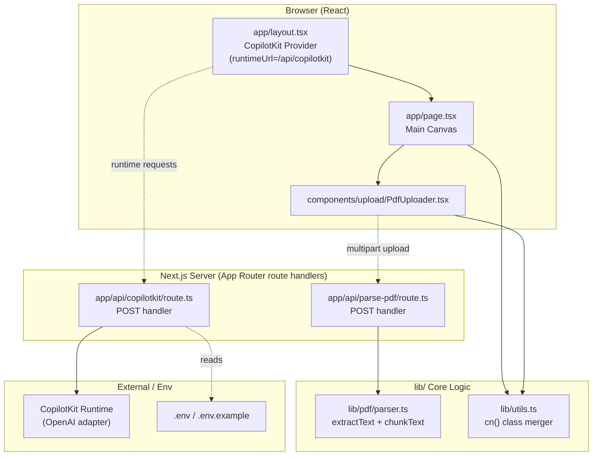
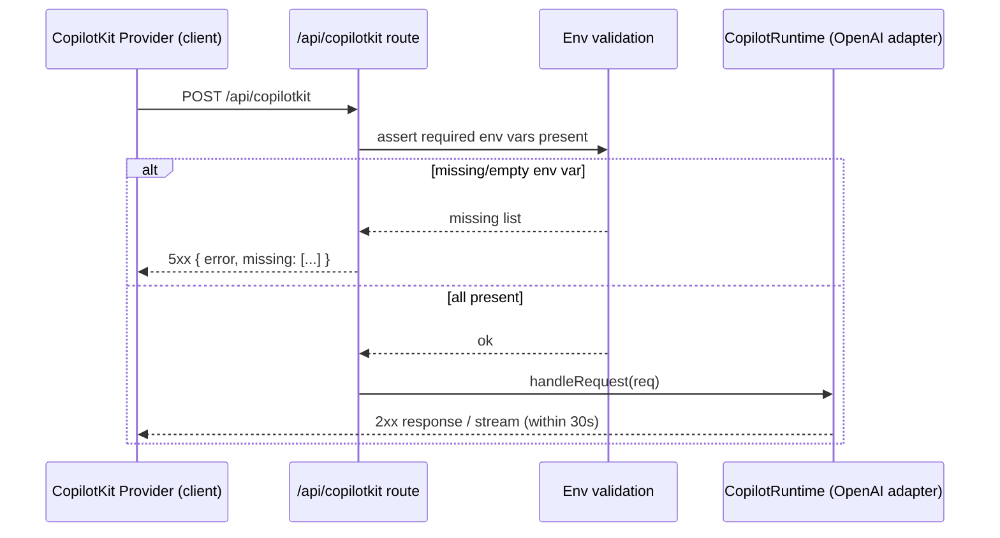
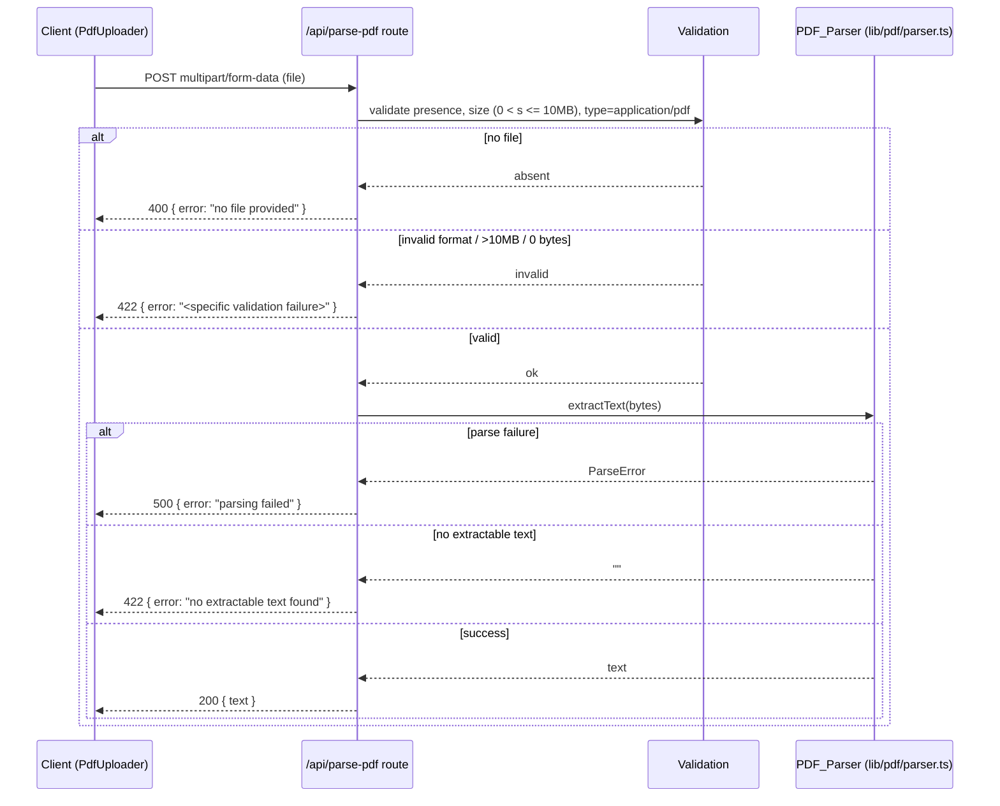

# Design Document

## Overview

This design describes the foundational scaffolding for the Memorang AI Learning Agent. It delivers a working Next.js App Router project with TypeScript strict mode and TailwindCSS, a CopilotKit runtime endpoint at `/api/copilotkit`, a reusable PDF parsing/chunking utility at `lib/pdf/parser.ts`, a server-side PDF ingestion endpoint at `/api/parse-pdf`, and an `.env.example` template.

The scope is intentionally narrow: project initialization, configuration, endpoint wiring, and the PDF parsing utility. The LangGraph agent state machine (`lib/agent/*`) and the generative UI widgets (`components/widgets/*`) are explicitly out of scope and will be layered on top of this foundation in later specs. Where this scaffolding must reference agent concerns (for example, binding an agent to the CopilotKit runtime), it provides a minimal placeholder that later specs replace.

### Goals

- A type-safe, buildable Next.js App Router project (`next build` and `tsc --noEmit` both succeed).
- TailwindCSS wired so utility classes across `app/` and `components/` are detected and emitted.
- A CopilotKit runtime `POST` endpoint that responds to the CopilotKit React provider, and fails fast with a descriptive 5xx when required environment variables are absent.
- A pure, well-tested PDF parsing and text-chunking utility with a provable round-trip guarantee.
- A validating PDF ingestion endpoint with clear, specific HTTP error semantics.
- A documented environment template with safe placeholder values.

### Key Design Decisions

| Decision            | Choice                                                                               | Rationale                                                                                                                            |
| ------------------- | ------------------------------------------------------------------------------------ | ------------------------------------------------------------------------------------------------------------------------------------ |
| Framework           | Next.js App Router (v14+)                                                            | Required by requirements and steering `structure.md`; App Router colocates API route handlers with UI.                               |
| Language / typing   | TypeScript with `strict: true`                                                       | Required by R1.3; strict mode catches errors before runtime.                                                                         |
| Styling             | TailwindCSS + `tailwind-merge` + `clsx`                                              | Required by R2; `tailwind-merge` resolves conflicting utilities to the last value (R2.7).                                            |
| Agent/UI runtime    | CopilotKit (`@copilotkit/runtime`, `@copilotkit/react-core`, `@copilotkit/react-ui`) | Required by R3 and steering `tech.md`; provides `copilotRuntimeNextJSAppRouterEndpoint`.                                             |
| PDF text extraction | `unpdf`                                                                              | Runtime-agnostic, works in Next.js serverless route handlers without browser-global polyfills that `pdf-parse`/`pdfjs-dist` require. |
| Chunking            | Custom pure function in `lib/pdf/parser.ts`                                          | Deterministic, dependency-free, and directly testable via property-based tests (R4.7 round-trip).                                    |

### Research Summary

- **CopilotKit runtime**: The App Router integration exposes a runtime through the `copilotRuntimeNextJSAppRouterEndpoint` helper from `@copilotkit/runtime`, wired into a `POST` handler in `app/api/copilotkit/route.ts`. The React side uses `CopilotKit` from `@copilotkit/react-core`, pointing `runtimeUrl` at `/api/copilotkit`. The default model adapter requires an OpenAI API key supplied via environment variable. Content was rephrased for compliance with licensing restrictions. Source: [CopilotKit Quickstart](https://docs.copilotkit.ai/quickstart), [CopilotKit Copilot Runtime](https://docs.copilotkit.ai/langgraph-typescript/backend/copilot-runtime).
- **PDF parsing in Next.js**: Popular libraries `pdf-parse` and `pdfjs-dist` are awkward inside App Router route handlers because they assume browser globals or test-fixture file access, requiring polyfills/workarounds. `unpdf` is designed to run across JavaScript runtimes (including serverless) and exposes a straightforward text-extraction API, making it the lowest-friction choice for a server route. Content was rephrased for compliance with licensing restrictions. Sources: [unjs/unpdf](https://github.com/unjs/unpdf), [Extracting text from a PDF in Next.js](https://ultimatetools.hashnode.dev/extracting-text-from-a-pdf-in-next-js-server-side-api-route-with-pdfjs-dist-node-js-polyfills-and-line-reconstruction).

## Architecture

The scaffolding is organized into four cooperating layers that map directly to the directory structure in `structure.md`.



### Request Flows

**CopilotKit runtime request (R3):**



**PDF ingestion request (R5):**



### Layer Responsibilities

- **Configuration layer** (`package.json`, `tsconfig.json`, `next.config.js`, `tailwind.config.ts`, `app/globals.css`, `.env.example`): defines the build, type checking, styling detection, and required environment surface.
- **UI layer** (`app/layout.tsx`, `app/page.tsx`, `components/`): mounts the CopilotKit provider and the main canvas. Only the minimum needed to satisfy R2 and R3 wiring is scaffolded here.
- **API layer** (`app/api/copilotkit/route.ts`, `app/api/parse-pdf/route.ts`): route handlers that perform environment/input validation and delegate to core logic.
- **Core logic layer** (`lib/pdf/parser.ts`, `lib/utils.ts`): pure, framework-independent functions that are the primary target of automated tests.

## Components and Interfaces

### 1. Project Configuration (Requirements 1, 2)

- `package.json` declares pinned versions for `next`, `react`, `react-dom`, `typescript`, plus `@copilotkit/*`, `unpdf`, `clsx`, `tailwind-merge`, `tailwindcss`, and dev tooling. Every dependency uses an exact pinned version (no `^`, `~`, `*`, or empty fields) per R1.2.
- `tsconfig.json` sets `"strict": true` and standard Next.js compiler options (R1.3).
- `next.config.js` at the repository root (R1.8). It marks `unpdf` as a server-external package if needed so the PDF library is not bundled for the client.
- `tailwind.config.ts` content globs cover `./app/**/*.{ts,tsx}` and `./components/**/*.{ts,tsx}` (R2.1).
- `app/globals.css` contains the Tailwind `base`, `components`, and `utilities` directives (R2.2) and is imported exactly once in `app/layout.tsx` (R2.3).

### 2. `lib/utils.ts` — Class Name Merger (Requirement 2.7)

```typescript
import { clsx, type ClassValue } from "clsx";
import { twMerge } from "tailwind-merge";

/**
 * Merge a variadic list of class name values into a single string,
 * resolving conflicting Tailwind utilities to the last-specified value.
 */
export function cn(...inputs: ClassValue[]): string {
  return twMerge(clsx(inputs));
}
```

### 3. `app/layout.tsx` — Root Layout + CopilotKit Provider (Requirements 2.3, 3.5)

- Imports `./globals.css` exactly once.
- Wraps `children` in `<CopilotKit runtimeUrl="/api/copilotkit">` from `@copilotkit/react-core`.

### 4. `app/api/copilotkit/route.ts` — CopilotKit Runtime Endpoint (Requirement 3)

```typescript
import { NextRequest } from "next/server";

// Names of environment variables the runtime requires.
export const REQUIRED_COPILOT_ENV_VARS = ["OPENAI_API_KEY"] as const;

export function findMissingEnvVars(
  env: NodeJS.ProcessEnv,
  required: readonly string[] = REQUIRED_COPILOT_ENV_VARS,
): string[] {
  return required.filter((name) => {
    const value = env[name];
    return value === undefined || value.trim() === "";
  });
}

export async function POST(req: NextRequest): Promise<Response> {
  const missing = findMissingEnvVars(process.env);
  if (missing.length > 0) {
    return Response.json(
      { error: "Missing required environment variables", missing },
      { status: 503 },
    );
  }
  // Delegate to CopilotRuntime via copilotRuntimeNextJSAppRouterEndpoint.
  // A minimal runtime/adapter is configured here; agent binding is added
  // in a later spec (out of scope for scaffolding).
  const { handleRequest } = buildCopilotEndpoint();
  return handleRequest(req);
}
```

- The env-var check runs before any runtime processing, so missing configuration produces a 5xx naming each missing variable with no partial work (R3.6).
- `buildCopilotEndpoint()` encapsulates `CopilotRuntime` + `copilotRuntimeNextJSAppRouterEndpoint` construction.
- `findMissingEnvVars` is extracted as a pure function to make the validation logic testable in isolation.

### 5. `lib/pdf/parser.ts` — PDF Parser (Requirement 4)

Two responsibilities, split into two exported functions plus a typed error.

```typescript
/** Thrown/returned when a PDF cannot be parsed. */
export class PdfParseError extends Error {}
/** Thrown/returned when a chunk size is out of the allowed range. */
export class InvalidChunkSizeError extends Error {}

export const MIN_CHUNK_SIZE = 1;
export const MAX_CHUNK_SIZE = 100_000;

/**
 * Extract text from a PDF byte buffer, preserving original character order.
 * - Valid PDF with text  -> full text string
 * - Valid PDF, no text   -> "" (empty string)
 * - Invalid/corrupt PDF  -> rejects with PdfParseError (no partial text)
 */
export async function extractText(
  data: Uint8Array | ArrayBuffer,
): Promise<string>;

/**
 * Split text into ordered, contiguous, non-empty chunks each no larger than
 * `chunkSize` characters.
 * - Empty text            -> [] (empty collection)
 * - chunkSize out of range-> throws InvalidChunkSizeError (no chunks)
 * - Concatenation of chunks in order === original text (round-trip)
 */
export function chunkText(text: string, chunkSize: number): string[];
```

**`chunkText` algorithm:**

1. If `chunkSize` is not an integer or is `< MIN_CHUNK_SIZE` or `> MAX_CHUNK_SIZE`, throw `InvalidChunkSizeError` and return no chunks (R4.6).
2. If `text.length === 0`, return `[]` (R4.8).
3. Otherwise walk the string from index `0`, slicing `chunkSize` characters at a time until exhausted, pushing each non-empty slice. The final slice may be shorter than `chunkSize`. Every slice is non-empty and `<= chunkSize`, and slices are contiguous, so concatenation reproduces the input exactly (R4.4, R4.7).

> Note on characters: chunking operates on JavaScript string units (UTF-16 code units) consistently for both slicing and length checks, so the round-trip equality (`chunks.join("") === text`) holds for any input string, including non-ASCII content.

### 6. `app/api/parse-pdf/route.ts` — PDF Ingestion Endpoint (Requirement 5)

```typescript
import { NextRequest } from "next/server";
import { extractText } from "@/lib/pdf/parser";

const MAX_FILE_SIZE = 10 * 1024 * 1024; // 10 MB
const PDF_CONTENT_TYPE = "application/pdf";

export async function POST(req: NextRequest): Promise<Response> {
  const form = await req.formData();
  const file = form.get("file");

  // R5.5: no file -> 400
  if (!(file instanceof File)) {
    return Response.json({ error: "No file was provided" }, { status: 400 });
  }
  // R5.3 + R5.6: validate before parsing
  if (file.size === 0) {
    return Response.json(
      { error: "Uploaded file is empty (0 bytes)" },
      { status: 422 },
    );
  }
  if (file.size > MAX_FILE_SIZE) {
    return Response.json(
      { error: "File exceeds the 10 MB limit" },
      { status: 422 },
    );
  }
  if (file.type !== PDF_CONTENT_TYPE) {
    return Response.json(
      { error: "File is not application/pdf" },
      { status: 422 },
    );
  }

  try {
    const text = await extractText(await file.arrayBuffer());
    // R5.8: validated PDF but no extractable text -> 422
    if (text.length === 0) {
      return Response.json(
        { error: "No extractable text was found" },
        { status: 422 },
      );
    }
    // R5.4: success -> 200 with text
    return Response.json({ text }, { status: 200 });
  } catch {
    // R5.7: parser failure -> 500, no partial text
    return Response.json({ error: "Failed to parse the PDF" }, { status: 500 });
  }
}
```

Validation order matters: presence (400) is checked first, then size/type validations (422), and only a fully validated file reaches the parser. Parser failures (500) and empty extraction (422) are distinguished after invocation.

### 7. `.env.example` — Environment Template (Requirement 6)

Each required variable appears as a `NAME=value` pair on its own line, preceded by a comment describing its purpose and whether it is required or optional, with a descriptive placeholder (never a real secret). It documents every variable referenced by `REQUIRED_COPILOT_ENV_VARS` (R3.7, R6).

```dotenv
# OpenAI API key used by the CopilotKit runtime model adapter. (Required)
OPENAI_API_KEY=<your-openai-api-key>

# Public URL the CopilotKit React provider uses to reach the runtime. (Optional)
NEXT_PUBLIC_COPILOTKIT_RUNTIME_URL=<http://localhost:3000/api/copilotkit>
```

## Data Models

Scaffolding introduces only small, local types; there is no persistent data model at this stage (PostgreSQL/Redis are reserved for later agent specs).

```typescript
// lib/pdf/parser.ts
type ChunkSize = number; // integer, MIN_CHUNK_SIZE..MAX_CHUNK_SIZE inclusive
type ExtractedText = string; // "" allowed (no extractable text)
type Chunks = string[]; // ordered, contiguous, each non-empty and <= chunkSize

// app/api/parse-pdf/route.ts response shapes
interface ParsePdfSuccess {
  text: string;
}
interface ParsePdfError {
  error: string;
}

// app/api/copilotkit/route.ts error shape
interface CopilotEnvError {
  error: string;
  missing: string[];
}
```

- **`ChunkSize`**: valid range `[1, 100000]`, integer. Out-of-range values are rejected before any chunking.
- **`ExtractedText`**: the empty string is a valid, distinct outcome (valid PDF with no text) versus a `PdfParseError` (corrupt PDF).
- **`Chunks`**: invariant — `chunks.join("") === originalText` and `chunks.every(c => c.length > 0 && c.length <= chunkSize)`.

## Correctness Properties

_A property is a characteristic or behavior that should hold true across all valid executions of a system — essentially, a formal statement about what the system should do. Properties serve as the bridge between human-readable specifications and machine-verifiable correctness guarantees._

These properties apply only to the pure, input-varying logic in this scaffolding: the class-name merger (`cn`), the CopilotKit environment validation (`findMissingEnvVars`), the PDF text chunker (`chunkText`), the PDF extraction error path (`extractText`), and the PDF ingestion endpoint's validation guard. The remaining acceptance criteria are configuration/presence checks, external-tool behavior (TypeScript, Next.js build, TailwindCSS JIT, the `unpdf` and CopilotKit runtimes), or specific example scenarios — these are covered by smoke, integration, and example-based tests described in the Testing Strategy rather than by property-based tests.

### Property 1: Class merge resolves conflicts to the last value

_For any_ variadic list of class-name values, `cn(...inputs)` returns a single string, and when two inputs specify conflicting TailwindCSS utilities of the same category, the resulting string contains the last-specified value and not the earlier conflicting one.

**Validates: Requirements 2.7**

### Property 2: Missing-env detection is exact

_For any_ environment map over the required CopilotKit variable set, `findMissingEnvVars` returns exactly the subset of required variables whose value is undefined, empty, or whitespace-only — no present-and-non-empty variable is reported, and no absent-or-empty variable is omitted.

**Validates: Requirements 3.6**

### Property 3: Chunking is well-formed and lossless

_For any_ text string and any valid chunk size in `[1, 100000]`, `chunkText(text, size)` produces an ordered collection such that (a) concatenating the chunks in order exactly reproduces the input text with no characters inserted or removed, (b) every chunk is non-empty and no longer than `size`, and (c) when the input text is empty the collection is empty.

**Validates: Requirements 4.4, 4.7, 4.8**

### Property 4: Invalid chunk sizes are rejected

_For any_ chunk size that is not an integer within `[1, 100000]`, `chunkText` signals an invalid-chunk-size error and returns no chunks.

**Validates: Requirements 4.6**

### Property 5: Corrupt input never yields partial text

_For any_ byte buffer that is not a valid PDF, `extractText` signals a parse-failure error and does not return any (partial) text content.

**Validates: Requirements 4.5**

### Property 6: Validation guards the parser and maps status codes

_For any_ uploaded file descriptor (varying presence, byte size, and declared content type), the `/api/parse-pdf` handler invokes the PDF parser if and only if the file is present, its size is greater than 0 and at most 10 MB, and its content type is `application/pdf`; when the file is absent the response status is 400, and when the file is present but fails size or type validation the response status is 422 — in both failing cases the parser is not invoked.

**Validates: Requirements 5.3, 5.5, 5.6**

## Error Handling

| Source              | Condition                                      | Handling                                                                                                   | Requirement |
| ------------------- | ---------------------------------------------- | ---------------------------------------------------------------------------------------------------------- | ----------- |
| CopilotKit endpoint | Required env var missing/empty at request time | Return 503 (5xx) with `{ error, missing: [...] }` naming each missing var; do not start runtime processing | R3.6        |
| `chunkText`         | Chunk size out of `[1,100000]` or non-integer  | Throw `InvalidChunkSizeError`; return no chunks                                                            | R4.6        |
| `extractText`       | Corrupt/invalid PDF bytes                      | Reject with `PdfParseError`; return no partial text                                                        | R4.5        |
| parse-pdf endpoint  | No file in request                             | 400 with descriptive message; parser not invoked                                                           | R5.5        |
| parse-pdf endpoint  | 0 bytes / >10 MB / wrong content type          | 422 with specific validation message; parser not invoked                                                   | R5.3, R5.6  |
| parse-pdf endpoint  | Parser throws on validated file                | 500 with "parsing failed"; no partial text returned                                                        | R5.7        |
| parse-pdf endpoint  | Parser returns empty string on validated file  | 422 "no extractable text found"                                                                            | R5.8        |
| Build system        | Type errors                                    | Non-zero exit; per-file/line diagnostics (delegated to `tsc`)                                              | R1.5        |
| Build system        | Build/config error                             | Non-zero exit; cause message; no partial artifacts (delegated to Next.js/Tailwind)                         | R1.7, R2.6  |

Error responses use a consistent JSON shape (`{ error: string }`, extended with `missing: string[]` for the env case). Validation errors are distinguished from processing errors by status code so clients can react precisely.

## Testing Strategy

The feature spans configuration, external-tool integration, and pure logic, so it uses a layered strategy. Property-based tests target the pure logic; smoke, example, and integration tests cover configuration and external behavior.

### Property-Based Tests

- **Library**: `fast-check` (with the project's test runner, e.g. Vitest or Jest). Property-based testing is not implemented from scratch.
- **Iterations**: each property test runs a minimum of 100 generated cases.
- **Tagging**: each property test includes a comment referencing its design property in the form `Feature: project-scaffolding, Property <n>: <text>` (substituting the property number and text).
- **Coverage**: one property-based test per correctness property (Properties 1 through 6).
  - P1 — generate random class lists including known conflicting Tailwind utilities (e.g. paired `px-*`, `text-*`); assert string output and last-wins resolution.
  - P2 — generate random env maps assigning each required var one of {present-non-empty, absent, empty, whitespace}; assert the returned set equals the absent-or-empty subset.
  - P3 — generate arbitrary strings (including empty and non-ASCII) and valid chunk sizes; assert round-trip join equality, per-chunk size/non-empty bounds, and empty-input → empty-output.
  - P4 — generate integers outside `[1,100000]` and non-integers; assert `InvalidChunkSizeError` and no chunks.
  - P5 — generate random non-PDF byte buffers; assert `PdfParseError` and no returned text.
  - P6 — generate file descriptors varying presence/size/content-type with a spy parser; assert invoke-iff-valid and correct 400/422 status mapping.

### Unit / Example Tests

- `extractText` happy paths (R4.2, R4.3): fixture PDFs (text-bearing and text-free) under `public/`/test fixtures asserting exact/ordered text and empty-string respectively.
- parse-pdf status scenarios (R5.4, R5.7, R5.8): mocked parser returning text → 200; throwing → 500; returning `""` → 422.
- CopilotKit handler structure (R3.2, R3.5): `POST` is a function returning a `Response`; layout renders the provider with `runtimeUrl="/api/copilotkit"`.
- Well-known `cn` conflicts (R2.7): e.g. `cn("px-2", "px-4") === "px-4"`.

### Integration Tests

- CopilotKit runtime happy path (R3.3, R3.4): env set and runtime mocked → 2xx within timeout.
- TailwindCSS emission/omission (R2.4, R2.5): build and inspect generated CSS for a covered class (present) and an uncovered-path class (absent) — 1–2 representative examples.

### Smoke / Config Tests

- File presence and structure (R1.1, R1.8, R3.1, R4.1, R5.1, R6.1): assert scaffolded files exist.
- `package.json` pinned versions (R1.2): each of `next`, `react`, `react-dom`, `typescript` present with an exact-version string (no range/empty).
- `tsconfig.json` strict (R1.3); `tailwind.config.ts` content globs cover `app/` and `components/` (R2.1); `globals.css` directives (R2.2) imported once in `layout.tsx` (R2.3).
- Toolchain gates (R1.4, R1.6): `tsc --noEmit` exits 0; `next build` exits 0 and emits `.next` artifacts.
- Env template consistency (R3.7, R6.2, R6.3, R6.4, R6.5): every name in `REQUIRED_COPILOT_ENV_VARS` appears in `.env.example` as a `NAME=value` line with a non-empty descriptive placeholder and a preceding purpose/required-or-optional comment.

### Not Property-Tested (and why)

- **Build/config and file presence** (R1.1–R1.3, R1.8, R2.1–R2.3, R3.1, R4.1, R5.1, R6.1–R6.5): declarative configuration and one-shot checks — no meaningful input space to quantify over.
- **External tool behavior** (R1.5, R1.7, R2.4–R2.6, R3.3, R3.4): TypeScript compiler, Next.js build, TailwindCSS JIT, and the CopilotKit/OpenAI runtime are third-party and deterministic; verified with integration/smoke examples, not fuzzed.
- **`unpdf` extraction fidelity** (R4.2, R4.3): correct text extraction from real PDFs depends on the library; verified with fixtures rather than generated PDFs.
